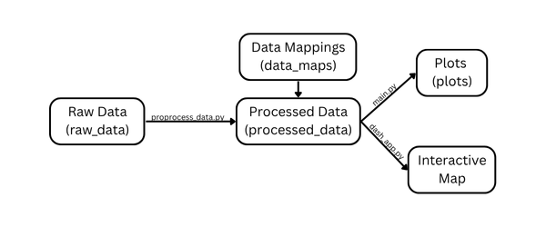

[](https://classroom.github.com/a/teJOLcnO)

# IDP Final Project
Our generation is the first to grow up immersed in digital technology. From phones and tablets to gaming consoles, screens are integrated in our daily lives. Now, in the aftermath of the COVID pandemic, people have been increasingly aware of screen time’s impact on health. As technology usage surged with remote schooling and work, existing guidelines around screen time relaxed significantly (University of the Witwatersrand). In recent years, research has begun to uncover the deeper mental health implications of this shift, with some studies demonstrating that excessive screen time can negatively impact our health—and this is particularly true for children and teenagers (National Institute of Drug Abuse).

Our project investigates the relationship between screen time and adolescent well-being. To guide our analysis, we posed three main research questions:
1. How does screen time affect adolescents’ ability to connect with others, and their depth of connections?
2. How do screen time and health trends vary across demographics (age, geography, etc)?
3. Do certain variables “buffer” or “catalyze” the relationship between screen time and health? In other words, can certain habits help limit the negative impact of screen time?


## Files and Folders
Here are the files and folders used for our project:
> **data_maps:** This folder contains .JSON maps used to rename dataset columns and convert labels to quantities  
  
> **data_organization:** This folder contains the preprocessed datasets.  
  
> **plots:** This folder contains the generated plots. The README file links and describes the initial plot sketches, too.  
  
> **resources:** These are various resources for us (developers) to reference.  
  
> **cse163_utils.py:** This file contains utility functions, primarily used for code testing (in run_tests.py)  
  
> **dash_app:** This file contains the code used for the interactive dash app.  
  
> **LICENSE:** This file outlines the MIT License for this code. This project is open-source.  
  
> **main.py:** This file contains the plot generation code. This is also where dataset merging happens (in `filter_concat_dfs()`) before plotting. See more on dataset merging in data_organized's [README.md](data_organized/README.md).
  
> **preprocess_data.py:** This file contains the preprocessing code used to create the clean datasets.  
  
> **run_tests.py:** This file contains the testing code for the Dash app.  

<br>
This is the flow of data to visualizations:



## Build Requirements & Dependencies

**Python Version:** 3.11 or newer is recommended  

**Required Python Packages:**
* Pandas
* Matplotlib
* Seaborn
* Plotly
* Dash
* Dash Bootstrap Components  

You can install all of these with an environment (e.g. Anaconda) or the following line:

```sh 
pip install pandas matplotlib seaborn plotly dash_bootstrap_components
```

### How to Run the Code Locally
1. Clone the repository:
```sh
git clone https://github.com/NCHS-CS/idp-final-project-raghav_and_jishnu.git
cd idp-final-project-raghav_and_jishnu  
```
2. Then, install dependencies as necessary (shown above).

3. Preprocess the data (if needed). This will use the .csv files from [raw_data](raw_data) and generate cleaned datasets in the [data_organized](data_organized) folder.
```sh
python preprocess_data.py
```

4. Run the main analysis and generate plots. Plots will be saved in the [plots](plots) folder
```sh
python main.py
```

5. To run the interactive Dash map, use the line below. Then, open the provided URL in your browser.
```sh
python run_tests.py
```
6. If you would like the run the Dash app test:
```sh
python run_tests.py
```
